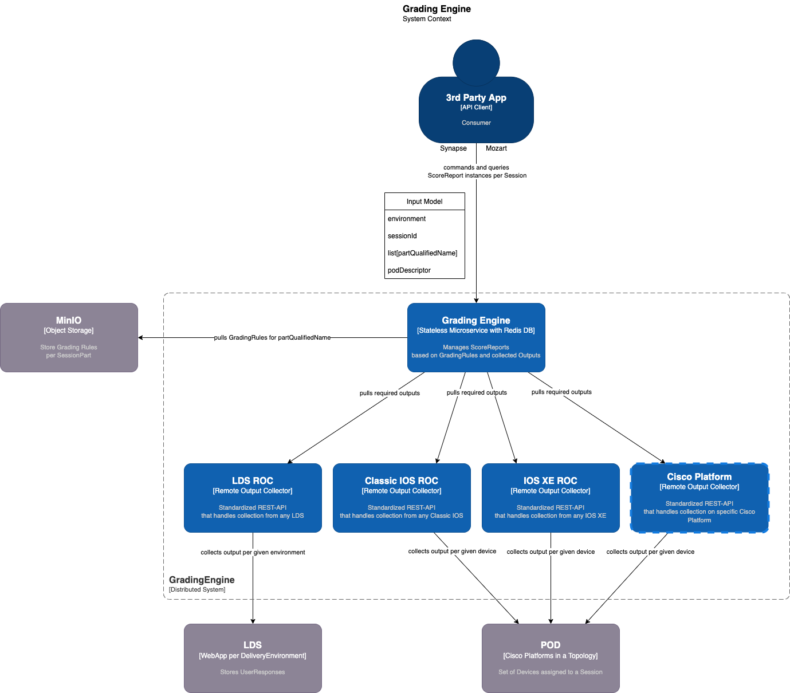

# IOS ROC

The Remote Output Collector for IOS-based devices (Classic IOS, IOS-XE).

## Overview

The IOS ROC exposes a standardised API that enables consumers to collect CommandLine outputs for a given device.

It simply proxies the HTTP request to the right device's access (via telnet) and returns the full text of the CommandLine output to the caller.

It offers collecting either a single CLI or multiple CLI per device.



## Collect CommandLineOutput From Device

### Endpoint

POST `/api/v1/cli/collect`

### Input

Body payload:

```json
{
  "pod_id": "string",
  "device": {
    "label": "string",
    "hostname": "test-dev-console",
    "interfaces": [
      {
        "name": "console",
        "protocol": "telnet",
        "ip": "150.101.20.48",
        "port": 3001,
        "authentication": {
          "properties": {
            "username": "neuro",
            "password": "Cisco123",
            "secret": "Cisco123"
          },
          "scheme": "basic"
        },
        "configuration": {
          "default_timeout": "15"
        }
      }
    ]
  },
  "commands": [
    {
      "line": "sh ver",
      "timeout": 5
    },
    {
      "line": "sh ip int brief",
      "timeout": 5
    },
    {
      "line": "sh ip ro",
      "timeout": 5
    },
    {
      "line": "conf t",
      "timeout": 5
    },
    {
      "line": "no ip domain-lookup",
      "timeout": 5
    },
    {
      "line": "end",
      "timeout": 5
    },
    {
      "line": "ping 1.1.1.11",
      "timeout": 5
    },
    {
      "line": "ping 1.1.1.1",
      "timeout": 15
    }
  ],
  "use_console": true
}
```

### Response

`UserResponses`:

```json
{
  "results": [
    {
      "command": "sh ver",
      "succeeded": true,
      "duration": "0:00:00.398464",
      "output": "Cisco IOS XE Software, Version 16.10.01b\nCisco IOS Software [Gibraltar], Virtual XE Software (X86_64_LINUX_IOSD-UNIVERSALK9-M), Version 16.10.1b, RELEASE SOFTWARE (fc1)\nTechnical Support: http://www.cisco.com/techsupport\nCopyright (c) 1986-2018 by Cisco Systems, Inc.\nCompiled Wed 12-Dec-18 02:52 by mcpre\n\n\nCisco IOS-XE software, Copyright (c) 2005-2018 by cisco Systems, Inc.\nAll rights reserved.  Certain components of Cisco IOS-XE software are\nlicensed under the GNU General Public License (\"GPL\") Version 2.0.  The\nsoftware code licensed under GPL Version 2.0 is free software that comes\nwith ABSOLUTELY NO WARRANTY.  You can redistribute and/or modify such\nGPL code under the terms of GPL Version 2.0.  For more details, see the\ndocumentation or \"License Notice\" file accompanying the IOS-XE software,\nor the applicable URL provided on the flyer accompanying the IOS-XE\nsoftware.\n\n\nROM: IOS-XE ROMMON\n\ntest-dev-console uptime is 3 weeks, 6 days, 16 hours, 53 minutes\nUptime for this control processor is 3 weeks, 6 days, 16 hours, 54 minutes\nSystem returned to ROM by reload\nSystem image file is \"bootflash:packages.conf\"\nLast reload reason: Critical process linux_iosd_image fault on rp_0_0 (rc=134)\n\n\n\nThis product contains cryptographic features and is subject to United\nStates and local country laws governing import, export, transfer and\nuse. Delivery of Cisco cryptographic products does not imply\nthird-party authority to import, export, distribute or use encryption.\nImporters, exporters, distributors and users are responsible for\ncompliance with U.S. and local country laws. By using this product you\nagree to comply with applicable laws and regulations. If you are unable\nto comply with U.S. and local laws, return this product immediately.\n\nA summary of U.S. laws governing Cisco cryptographic products may be found at:\nhttp://www.cisco.com/wwl/export/crypto/tool/stqrg.html\n\nIf you require further assistance please contact us by sending email to\nexport@cisco.com.\n\nLicense Level: ax\nLicense Type: N/A(Smart License Enabled)\nNext reload license Level: ax\n\n\nSmart Licensing Status: UNREGISTERED/No Licenses in Use\n\ncisco CSR1000V (VXE) processor (revision VXE) with 2170974K/3075K bytes of memory.\nProcessor board ID 9JOHBOLHIGA\n3 Gigabit Ethernet interfaces\n32768K bytes of non-volatile configuration memory.\n3984372K bytes of physical memory.\n7774207K bytes of virtual hard disk at bootflash:.\n0K bytes of WebUI ODM Files at webui:.\n\nConfiguration register is 0x2102\n\nte"
    },
    {
      "command": "sh ip int brief",
      "succeeded": true,
      "duration": "0:00:00.269150",
      "output": "Interface              IP-Address      OK? Method Status                Protocol\nGigabitEthernet1       150.101.20.48   YES NVRAM  up                    up      \nGigabitEthernet2       192.168.51.100  YES NVRAM  up                    up      \nGigabitEthernet3       unassigned      YES NVRAM  administratively down down    \nLoopback0              1.1.1.11        YES NVRAM  up                    up      \ntest-dev-console#"
    },
    {
      "command": "sh ip ro",
      "succeeded": true,
      "duration": "0:00:00.247938",
      "output": "Codes: L - local, C - connected, S - static, R - RIP, M - mobile, B - BGP\n       D - EIGRP, EX - EIGRP external, O - OSPF, IA - OSPF inter area \n       N1 - OSPF NSSA external type 1, N2 - OSPF NSSA external type 2\n       E1 - OSPF external type 1, E2 - OSPF external type 2, m - OMP\n       n - NAT, Ni - NAT inside, No - NAT outside, Nd - NAT DIA\n       i - IS-IS, su - IS-IS summary, L1 - IS-IS level-1, L2 - IS-IS level-2\n       ia - IS-IS inter area, * - candidate default, U - per-user static route\n       H - NHRP, G - NHRP registered, g - NHRP registration summary\n       o - ODR, P - periodic downloaded static route, l - LISP\n       a - application route\n       + - replicated route, % - next hop override, p - overrides from PfR\n\nGateway of last resort is 150.101.20.254 to network 0.0.0.0\n\nS*    0.0.0.0/0 [1/0] via 150.101.20.254\n      1.0.0.0/32 is subnetted, 1 subnets\nC        1.1.1.11 is directly connected, Loopback0\n      150.101.0.0/16 is variably subnetted, 2 subnets, 2 masks\nC        150.101.20.0/24 is directly connected, GigabitEthernet1\nL        150.101.20.48/32 is directly connected, GigabitEthernet1\n      192.168.51.0/24 is variably subnetted, 2 subnets, 2 masks\nC        192.168.51.0/24 is directly connected, GigabitEthernet2\nL        192.168.51.100/32 is directly connected, GigabitEthernet2\ntest-dev-console#"
    },
    {
      "command": "conf t",
      "succeeded": true,
      "duration": "0:00:00.256944",
      "output": "Enter configuration commands, one per line.  End with CNTL/Z.\ntest-dev-console(config)#"
    },
    {
      "command": "no ip domain-lookup",
      "succeeded": true,
      "duration": "0:00:00.380267",
      "output": "test-dev-console(config)#"
    },
    {
      "command": "end",
      "succeeded": true,
      "duration": "0:00:00.214142",
      "output": "test-dev-console#"
    },
    {
      "command": "ping 1.1.1.11",
      "succeeded": true,
      "duration": "0:00:00.425224",
      "output": "Type escape sequence to abort.\nSending 5, 100-byte ICMP Echos to 1.1.1.11, timeout is 2 seconds:\n!!!!!\nSuccess rate is 100 percent (5/5), round-trip min/avg/max = 1/1/1 ms\ntest-dev-console#"
    },
    {
      "command": "ping 1.1.1.1",
      "succeeded": false,
      "error": "A <class 'netmiko.exceptions.ReadTimeout'> exception occurred when collecting 'ping 1.1.1.1' from device test-dev-console: \nPattern not detected: 'test-dev-console' in output.\n\nThings you might try to fix this:\n1. Explicitly set your pattern using the expect_string argument.\n2. Increase the read_timeout to a larger value.\n\nYou can also look at the Netmiko session_log or debug log for more information.\n\n",
      "duration": "0:00:00",
      "output": ""
    }
  ]
}

```

## Features

*Functional*

- [x] Collect one or more CommandLine(s) per Device
  - [x] Define a `timeout` value per CommandLine
  - [x] Handle and report errors per CommandLine
  - [ ] Implement customizable retry strategy per CommandLine
  - [ ] Auto-increment `timeout` on each retry per CommandLine
- [x] Define one or more Interface per Device
  - [x] Use the first Interface listed if `use_console: False` or `use_console: None`
  - [ ] Implement auto-fallback on console Interface if selected Interface failed
  - [ ] Select which Interface to use per CommandLine
- [x] Emit CloudEvents for orchestration and observability
  - [x] `cli-collection.requested.v1`
  - [x] `cli-collection.completed.v1`
  - [x] `cli-collection.failed.v1`

*Infra*

- [x] Portable app (Docker container)
- [x] K8s deployment.yaml (incl. Istio virtual service)
- [x] OpenAPI specs and SwaggerUi
- [x] Protect collection endpoint with OAuth2
  - [x] JWT Authentication
  - [ ] Claim-based Authorization
- [x] Full Asynchronous Request handling


## App Settings

TODO

## Deployment

TODO
